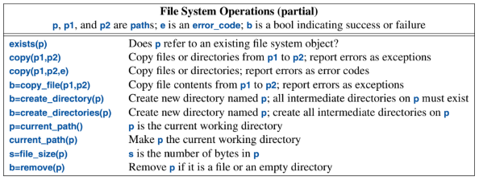

# A Tour of C++ (Stroustrup) — Ch. 11: Input and Output

---

## Output

The I/O stream library defines output for every built-in type with `<ostream>`. Also, the operator `<<` ("put to") is used as an output operator on objects of type `ostream`.

Values written to `cout` are converted to a sequence of characters. For example:

```cpp
int i = 10;
cout << "the value of i is " << i << '\n';
```

will produce: `the value of i is 10`

## Input

The standard library offers `istream`s for input with `<istream>`. The operator `>>` ("get from") is used as an input operator, with the type of the right-hand operand of `>>` determining what input is accepted.

Like output operations, input operations can be chained. For example:

```cpp
int i;
double d;
cin >> i >> d;
```

A suitable input sequence would be:
```
1234
12.34e5
```

`cin` only reads to the first whitespace character, whether a space or a newline. To read a full line, use the `getline()` function.

## I/O State

`iostream`s have state that we can examine to determine whether operations succeeded. For example:

```cpp
vector<int> read_ints(istream& is, const string& terminator)
{
    vector<int> res;
    for (int i; is >> i;)
        res.push_back(i);

    if (is.eof())        // fine: end of file
        return res;

    if (is.fail()) {     // we failed to read an int; was it the terminator?
        is.clear();      // reset the state back to good()
        string s;
        if (is >> s && s == terminator)
            return res;
        is.setstate(ios_base::failbit);  // add fail() to is's state
    }
    return res;
}

auto v = read_ints(cin, "stop");
```

**What this is doing (the stream-state dance):** a stream has flags -- `good()`, `eof()` (hit end of input), `fail()` (a formatted read failed, e.g. wrong type), `bad()` (serious corruption).

- `for (int i; is >> i;)` -- `is >> i` returns the stream, which converts to `bool` = **`false` when the read fails**. So the loop keeps reading ints until extraction stops (either EOF or a non-int token).
- After the loop the stream is in a failed state, so we ask *why*:
  - `is.eof()` → we ran out of input cleanly → return what we have.
  - `is.fail()` → we hit something that wasn't an int. Maybe it's the terminator word. So `is.clear()` **resets the flags back to `good()`** (a failed stream is unusable until cleared), then we try to read a string `s`. If `s == terminator`, that's a clean stop → return `res`. Otherwise it's unexpected garbage, so `is.setstate(ios_base::failbit)` **re-raises `fail()`** to signal the error to the caller.

Key APIs: `is >> x` in a bool context tests success; `is.clear()` resets to good; `is.setstate(ios_base::failbit)` manually turns `fail()` back on.

## I/O for User-Defined Types

Assume we have the struct:

```cpp
struct Entry {
    string name;
    int number;
};
```

We can define input and output as:

```cpp
ostream& operator<<(ostream& os, const Entry& e)
{
    return os << "{\"" << e.name << "\", " << e.number << "}";
}

istream& operator>>(istream& is, Entry& e)   // read { "name", number } pair
{
    char c, c2;
    if (is >> c && c == '{' && is >> c2 && c2 == '"') {  // start with a { followed by a "
        string name;                     // default value of a string is the empty string: ""
        while (is.get(c) && c != '"')    // anything before a " is part of the name
            name += c;
        if (is >> c && c == ',') {
            int number = 0;
            if (is >> number >> c && c == '}') {  // read the number and a }
                e = {name, number};      // assign to the entry
                return is;
            }
        }
    }
    is.setstate(ios_base::failbit);      // register the failure in the stream
    return is;
}
```

## Output Formatting

`<iostream>` provides facilities primarily for formatting streams of numbers. `<format>` provides facilities primarily for `printf()`-style formatting.

### Stream Formatting

*Manipulators* are found in `<ios>`, `<istream>`, `<ostream>` and `<iomanip>`. We can output integers as decimal, octal, and hex like:

```cpp
cout << 1234 << ' ' << hex << 1234 << ' ' << oct << 1234 << ' ' << dec << 1234 << '\n';// 1234 4d2 2322 1234
```

(Added the `<< ' '` before `dec` -- without it, `2322` and the final `1234` would run together as `23221234`. Also note `hex`/`oct`/`dec` are **sticky**: they stay in effect until changed, which is why the last `dec` is needed to switch back.)

`<<` can also handle time and dates. For example:

```cpp
cout << "birthday: " << November/28/2021 << '\n';
cout << "zt: " << zoned_time{current_zone(), system_clock::now()} << '\n';
```

### `printf()`-style Formatting

In `<format>`, the standard-library provides a `printf()`-style formatting mechanism. For example:

```cpp
std::string val = "World!";
string s = format("Hello, {}\n", val);
```

See documentation for additional details on `format()` formatting.

## Streams

All the standard-library streams are templates with their character type as a parameter. For example, `ostream` is `basic_ostream<char>`. The standard library also provides a `wchar_t` version. For example `wostream` is `basic_ostream<wchar_t>`.

### Standard Streams

The standard streams are:

* `cout` for ordinary output
* `cerr` for unbuffered error output
* `clog` for buffered logging output
* `cin` for standard input

### File Streams

`<fstream>` provides streams to and from files:

* `ifstream` for reading a file
* `ofstream` for writing a file
* `fstream` for reading and writing a file

### String Streams

`<sstream>` provides streams to and from a `string` -- `istringstream`, `ostringstream`, and `stringstream`.

### Memory Streams

`ispanstream`, `ospanstream`, and `spanstream` (available as of **C++23**) make streams to memory available -- i.e. reading/writing formatted data straight into a fixed `span` buffer, no allocation.

### Synchronized Streams

In multi-threaded systems, we need to ensure either:

1. Only one `thread` ever uses the stream.
2. Access to a stream is synchronized so that only one `thread` at a time gains access.

`osyncstream` guarantees that a sequence of output operations will complete and their results will be as expected in the output buffer even if some other `thread` tries to write.

Let's say we have one thread that does:

```cpp
void safer(int x, string& s) {
    osyncstream oss(cout);
    oss << x;
    oss << s;
}
```
Other `thread`s that also use `osyncstream` will not interfere.

## C-style I/O

The C++ standard library also provides C-style I/O like `printf()` and `scanf()`. However, these can have security and performance issues compared to the C++ I/O.

## File System

The file system library `<filesystem>` provides cross-platform portability.

Some functions to know from it:

```cpp
// Check if a file exists.
path f = "dir/hypothetical.cpp";
assert(exists(f));
if (is_regular_file(f))
    ...

// Use a path to open a file
ofstream f { p };
if (!f) error("bad file name: ", p);

// Check if it's a directory
if (is_directory(p)) {
    for (const directory_entry& x : directory_iterator{p}) {
        cout << "  " << x.path() << '\n';
        const path & f = x;
        if (f.extension() == ".exe") {
            cout << f.stem() << " is a Windows executable.\n";
        }
    }
}
```

### Files and Directories

The standard library offers many functions for file and directory manipulation:



