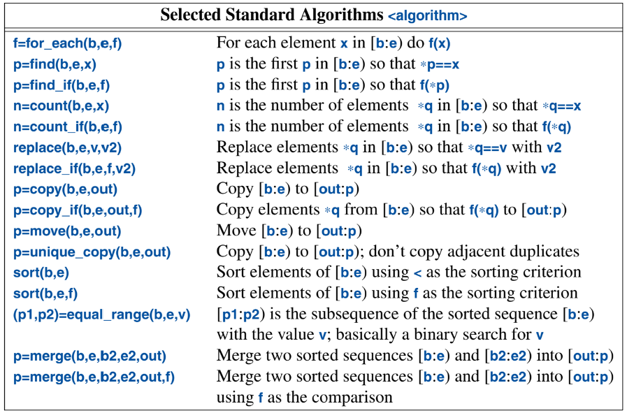

# A Tour of C++ (Stroustrup) — Ch. 12: Containers

---

A class with the main purpose of holding objects is commonly called a *container*.

**Quick map of the standard containers (know these by their trade-offs):**

| Container | Structure | Lookup | Notable |
|---|---|---|---|
| `vector<T>` | contiguous array | O(n) scan, O(1) index | **default choice**; cache-friendly; grows |
| `array<T,N>` | fixed contiguous | O(1) index | stack-allocated, size fixed at compile time |
| `list<T>` | doubly-linked | O(n) | O(1) splice; stable iterators |
| `forward_list<T>` | singly-linked | O(n) | minimal footprint; no `size()` |
| `map<K,V>` | balanced BST (red-black) | O(log n) | **ordered** keys |
| `unordered_map<K,V>` | hash table | O(1) average | **unordered**; needs hash + `==` |
| `set` / `unordered_set` | as above, keys only | — | unique keys |

Also: **`emplace_*`** builds the element in place from constructor args (no temporary/copy); **`push_back`/`insert`** copy or move an already-built object in.

## `vector`

A vector is a sequence of elements of a given type, stored contiguously in memory.

A `vector` can be initialized with a set of values of its element type:

```cpp
vector<Entry> phone_book = {
    {"David Hume", 123456},
    {"Karl Popper", 234567},
    {"Bertrand Arthur William Russell", 345678}
};
```

We can also access elements through subscripting, like `phone_book[i]`. Indexing starts at `0`.

A `vector` is a range, so we can use a range-`for` loop.

`vector` has members `capacity()`, `reserve()`, and `push_back()`. The `reserve()` function is used by users to make room for more elements. **It may have to allocate new memory and move elements**, which would invalidate any pointers to those elements.

> **Invalidation (a recurring container theme):** a `vector` that **reallocates** (any `push_back`/`insert`/`resize` past `capacity()`) invalidates **all** existing pointers, references, and iterators into it -- they now point at the freed old buffer (the dangling footgun again). `reserve()` up front avoids repeated reallocation. By contrast, `list`/`map` are **node-based**: inserting/erasing does **not** invalidate references to *other* elements -- that stability is a big reason to choose them.

> Aside: `capacity()` (allocated slots) ≥ `size()` (elements in use). Growth is amortized O(1) because the capacity roughly doubles on each reallocation.

### Elements

`vector` can store elements of built-in types, user-defined types, and pointers.

If we have a class hierarchy that relies on `virtual` functions for polymorphism, **do not store objects directly in a container**. Instead, store a pointer (i.e. smart pointer)..

### Range Checking

**Note**: Accessing elements with the `[]` operator does **not** guarantee range checking. So this will give undefined behavior, since it's index-based access:

`auto entry = phone_book[phone_book.size()];`

If you use the `at()` function for an invalid index, it will throw an `out_of_range` exception.

**Why doesn't the standard `[]` operation perform range checking?** Because it adds a performance cost of ~10%.

## `list`

The standard library `list` is a doubly-linked list implementation. We use `list` for sequences where we want to insert and delete elements without moving other elements.

A benefit of this implementation is that we can insert an element at a specific location:

```cpp
void f(const Entry& ee, list<Entry>::iterator p, list<Entry>::iterator q)
{
    phone_book.insert(p, ee);  // add ee before the element referred to by p
    phone_book.erase(q);       // remove the element referred to by q
}
```

For a `list`, `insert(p, elem)` inserts an element with a copy of the value `elem` **before** the element pointed to by `p`.

> "A `vector` performs better for traversal (e.g. `find()` and `count()`) and for sorting and searching (e.g. `sort()` and `equal_range()`)".

**Why `vector` often beats `list` even for middle insertion** -- it comes down to **cache locality** vs. **theoretical complexity**:

* On paper, `list` insertion is O(1) (just relink pointers) while `vector` insertion is O(n) (shift all following elements). So `list` "should" win.
* In practice, `vector` stores elements **contiguously**, so it's extremely **cache-friendly** -- the CPU prefetches whole cache lines, and shifting elements is a fast linear `memmove`. `list` scatters nodes across the heap, so every traversal step is a likely **cache miss** (chase a pointer to a random address), and each node needs a separate allocation.
* Crucially, to insert "in the middle" you first have to **find** the position. For a `list` that means walking the chain node-by-node (cache miss per hop); for a `vector` it's a linear scan over contiguous memory (fast). The finding usually dominates, and that's where `vector` wins big.
* Also: two `list` pointers per node + per-node heap allocation = more memory and allocator overhead.

**Rule of thumb (from Stroustrup/Sutter):** default to `vector`. Reach for `list` only when you have *large* elements, need **stable references/iterators that survive insertion** (a big `list` guarantee `vector` lacks), or splice whole ranges. For small elements, `vector` almost always wins even for the operations `list` is "supposed" to be good at.

## `forward_list`

`forward_list` is a singly-linked list. The point is to save space. It doesn't even keep its number of elements.

## `map`

The standard library `map` is a balanced binary search tree (usually a red-black tree). This is a container of pairs of values optimized for lookup and insertion.

Much like `list` and `vector`, we can use the `[]` operator for a `map`. If a `key` isn't found, it is entered into the `map` with a default value for its value.

> ⚠️ **Two gotchas with `map::operator[]`:**
> 1. It **inserts** on a missing key -- so a mere *lookup* like `if (m[k] == ...)` silently grows the map. Use `m.find(k)` or `m.contains(k)` (C++20) for a non-mutating check.
> 2. It **won't compile on a `const map`** (because it might insert). On a const map, use `.at(k)` (throws if absent) or `.find(k)`.

## `unordered_map`

The cost of a `map` lookup is `O(log(n))`. If we need faster lookup, we can use an `unordered_map` container, which uses a hash table for lookup.

We can define our own hash function is necessary:

```cpp
struct Record {
    string name;
    int product_code;
    //  ...
};

bool operator==(const Record&, const Record&) { /* ... */ }

struct Rhash {   // a hash function for Record
    size_t operator()(const Record& r) const
    {
        return hash<string>()(r.name) ^ hash<int>()(r.product_code);
    }
};

unordered_set<Record, Rhash> my_set;  // set of Records using Rhash for lookup
```

Note the use of the exclusive-or (`^`). Also note the differences between a map and an unordered_map:

* A map requires an ordering function (the default is `<`) and yields an ordered sequence.
* An unordered_map requires an equality function (the default is `==`) **and a hash function**; it does not maintain an order among its elements.

(The example above uses `unordered_set` -- same rules, it just stores keys only, no mapped value. The `set`/`map` and `unordered_set`/`unordered_map` pairs differ only in "keys-only" vs "key→value".)

**When to pick which:** use `map`/`set` (ordered) when you need sorted iteration, range queries, or `<` is available but a good hash isn't; use `unordered_map`/`unordered_set` when you just need fast lookup and don't care about order. Ordered = O(log n) guaranteed; unordered = O(1) average but O(n) worst case, and you must supply a hash.

## Allocators

By default, standard-library containers allocate space using `new` and `delete`.

Custom allocators can be introduced for specific purposes, like performance (e.g. pool allocators), security (allocators that clean-up memory as part of deletion), per-thread allocation, and non-uniform memory architectures.

Pool allocators are supported in C++ by the `pmr` ("polymorphic memory resource") sub-namespace of `std`.

The standard `pmr` memory resources:
* `std::pmr::synchronized_pool_resource` -- a pool allocator that **is** thread-safe.
* `std::pmr::unsynchronized_pool_resource` -- like the above but **not** thread-safe (single-thread use only, so no locking overhead).
* `std::pmr::monotonic_buffer_resource` -- a very fast allocator that **never frees individual allocations**; it releases *all* its memory at once when the resource is destroyed. Single-thread. Great for a burst of allocations with a common lifetime (e.g. per-request/per-frame arena).

A custom resource must **derive from `std::pmr::memory_resource`** and implement `do_allocate()`, `do_deallocate()`, and `do_is_equal()` (the public non-virtual `allocate()`/`deallocate()`/`is_equal()` call these). The idea is for users to build their own resources to tune code.

Key mechanism: a `std::pmr` container (e.g. `std::pmr::vector`) holds a `memory_resource*`, so **the allocator is a runtime value, not a template parameter** -- you can swap allocation strategies without changing the container's type. (This is the "polymorphic" in `pmr`.)

An emplace operation, such as `emplace_back()` takes arguments for an element's constructor and  builds the object in a newly allocated space in the container, rather than copying an object into the  container.

---

# A Tour of C++ (Stroustrup) — Ch. 13: Algorithms

---

The standard library provides the most common algorithms for containers. For example, it provides `sort()` for efficient sorting, and making a unique copy of elements with `unique_copy()`.

* `sort()` → needs `<` (or a custom comparator).
* `unique_copy()` / `unique()` → needs `==` (or a custom predicate), **and** only removes *adjacent* duplicates, so the input must be sorted first for it to remove *all* duplicates.

## Use of Iterators

All of the standard library containers provide the `begin()` and `end()` iterators. `end()` actually points to the element **after** the last element. This allows common algorithms to return `end()` to indicate "not found".

## Iterator Types

Iterator types will vary, based on the particular container type. For a `vector`, the iterator could be a pointer to an element. It could alternatively be a pointer to the `vector`, plus an index.

By comparison, a `list` iterator could be a pointer to a link.

Iterators all have the same core semantics. Applying `++` to any iterator yields an iterator that refers to the next element. And applying `*` yields the element to which the iterator refers.

Iterator is a `concept`, refined by a **hierarchy** of stronger iterator concepts -- each adds capabilities:

* `input_iterator` -- single-pass, read-only (`++`, `*` for reading). e.g. `istream_iterator`.
* `output_iterator` -- single-pass, write-only. e.g. `ostream_iterator`, `back_inserter`.
* `forward_iterator` -- multi-pass; can re-read. e.g. `forward_list`.
* `bidirectional_iterator` -- adds `--`. e.g. `list`, `map`.
* `random_access_iterator` -- adds `+ n`, `[]`, `<` (jump anywhere in O(1)). e.g. `vector`, `array`, `deque`.
* `contiguous_iterator` -- random-access **and** elements are physically adjacent (a real pointer works). e.g. `vector`, `array`.

An algorithm states the *weakest* category it needs; a stronger iterator satisfies it. (Same category ladder from the regex-iterator and ranges notes -- `sort` needs random-access, which is why you can `sort` a `vector` but not a `list`; `list` has its own `.sort()` member instead.)

### Stream Iterators

For a stream, we need to specify which stream will be used and the type of objects that will be used. For example:

```cpp
ostream_iterator<string> oo {cout}; // write strings to cout
*oo = "Hello, ";
oo++;
*oo = "world!\n";
```

Similarly, we can read from an input stream iterator `istream_iterator`. Here is an example of reading inputs from a file stream, eliminating duplicates, and writing the result to another file:

```cpp
int main()
{
    string from, to;
    cin >> from >> to;                    // get source and target file names
    ifstream is {from};                   // input stream for file "from"
    istream_iterator<string> ii {is};     // input iterator for stream
    istream_iterator<string> eos {};      // input sentinel (default-constructed)
    ofstream os {to};                     // output stream for file "to"
    ostream_iterator<string> oo {os,"\n"};// output iterator for stream plus a separator
    vector<string> b {ii,eos};            // b is a vector initialized from input
    sort(b);                              // sort the buffer
    unique_copy(b,oo);                    // copy to output, discard adjacent duplicates
    return !is.eof() || !os;              // return error state (§1.2.1, §11.4)
}
```

Since `set` maintains order and discards duplicates, we can simplify that code significantly:

```cpp
int main()
{
    string from, to;
    cin >> from >> to;                    // get source and target file names
    ifstream is {from};                   // input stream for file "from"
    ofstream os {to};                     // output stream for file "to"
    set<string> b {istream_iterator<string>{is}, istream_iterator<string>{}};  // read input
    copy(b, ostream_iterator<string>{os,"\n"});  // copy to output
    return !is.eof() || !os;              // return error state (§1.2.1, §11.4)
}
```

## Use of Predicates

Some functions will operate upon elements that fulfill a specific requirement, a *predicate*. For example, we can search for all elements where the `int` is greater than `42`:

```cpp
std::map<string, int> m;
...
auto p = find_if(m, [](const auto& r) { return r.second > 42; });
```

(This is the **ranges** form -- `find_if(m, pred)` taking a whole range, i.e. `std::ranges::find_if`, not the two-iterator `std::find_if(b, e, pred)`. It returns an **iterator** to the first match, or `m.end()` if none -- so check `if (p != m.end())` before using it. `m`'s elements are `pair<const string, int>`, hence `r.second`.)

## Algorithm Overview

The algorithms in the standard library are defined in the `<algorithm>` and `<numeric>` headers. A half-open sequence from `b` to `e` is referred to as `[b:e)` -- includes `b`, excludes `e`.

Here are some common algorithms:



For each algorithm that takes a `[b:e)` range, `<ranges>` offers a version that takes a range.

Some algorithms will modify element values. However, no algorithms add or subtract elements from a container. This is because a sequence (a `[b:e)` iterator pair) does not identify the container that holds the elements -- it only knows *where* the elements are, not *who owns* them. (This is why `remove`/`remove_if` don't actually shrink the container: they shuffle the "kept" elements to the front and return a new logical end; you still need `container.erase(...)` -- or `std::erase_if` -- to drop the tail. The **erase-remove idiom** from the Code Review notes.)

To add or delete, we'd need something that knows about the container (e.g. a `back_inserter`) or we'd need to directly refer to the container itself.

`back_inserter(c)` returns an **output iterator** whose `*it = x` actually calls `c.push_back(x)` -- so an algorithm that "writes to an output iterator" ends up *growing* the container. This is how e.g. `copy(src, back_inserter(dst))` appends instead of overwriting. (Related: `front_inserter` → `push_front`, `inserter` → `insert`.) Without one of these, an algorithm like `copy` assumes the destination **already has room** and just overwrites existing slots.

## Parallel algorithms

When the same task is performed on many data elements, if the computations on the different elements are independent, then we can execute the algorithm in parallel.

*Parallel execution* is when tasks are done on multiple threads. *Vectorized execution* is when tasks are done on a single thread using vectorization.

In `<execution>` in namespace `execution`, we find:

* `seq`: sequential execution
* `par`: parallel execution
* `unseq`: unsequenced (vectorized) execution
* `par_unseq`: parallel and/or unsequenced (vectorized) execution

Whether or not parallelization or vectorization makes sense depends on the algorithm, number of elements, the hardware, and the utilization of the hardware by programs. So the *execution policy indicators* are just hints, and the implementation decides how much concurrency to use.

> ⚠️ One catch with `par`/`par_unseq`: the element operations must be **safe to run concurrently** (no data races, and `unseq` code mustn't take locks). It's *your* job to guarantee that -- the policy is a hint, not a magic thread-safety wand.

Nearly all standard algorithms have a parallelized implementation **except for** `equal_range`, since there hasn't been an efficient parallel version.

**Why `equal_range` (and the binary-search family) doesn't get a parallel version:** because there's **nothing worth parallelizing**.

* `equal_range` on a sorted range is essentially two binary searches (`lower_bound` + `upper_bound`). Binary search is **O(log n)** -- it only ever *touches* ~log₂(n) elements. For a billion elements that's ~30 comparisons total.
* Parallel algorithms pay off by **splitting many element-operations across cores**. But binary search barely does any work, and each step is **data-dependent on the previous** (where you probe next depends on the last comparison's result) -- so it's inherently sequential and there's no big pile of independent work to divide.
* Spawning/coordinating threads costs *far* more than 30 comparisons. So a "parallel binary search" would be **slower**, not faster. → not provided.
* Same reasoning excludes `binary_search`, `lower_bound`, `upper_bound`. Contrast with `sort`, `for_each`, `transform`, `reduce`, which do O(n)+ independent work → real parallel speedups.
