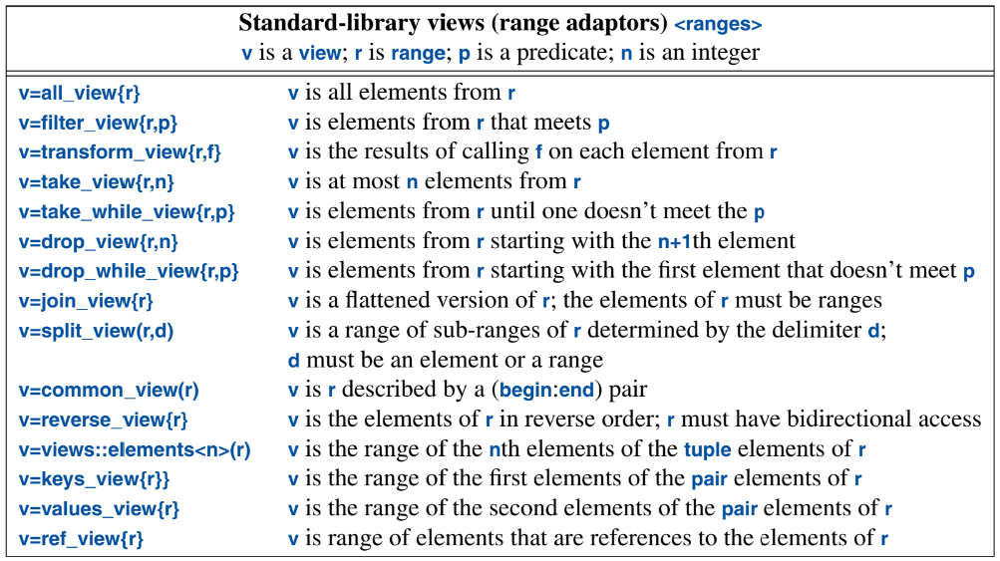
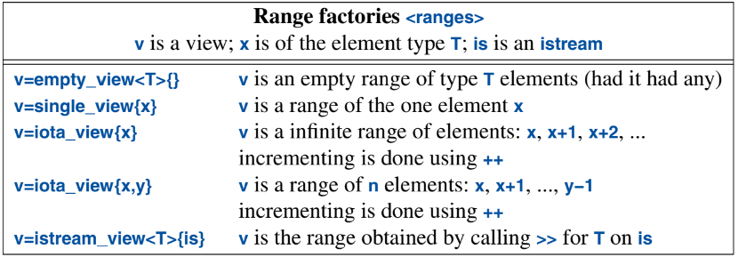
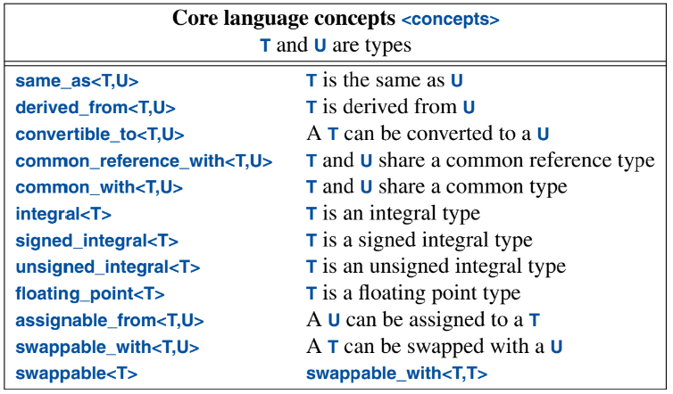
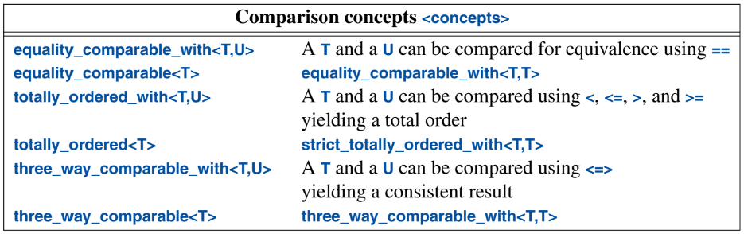
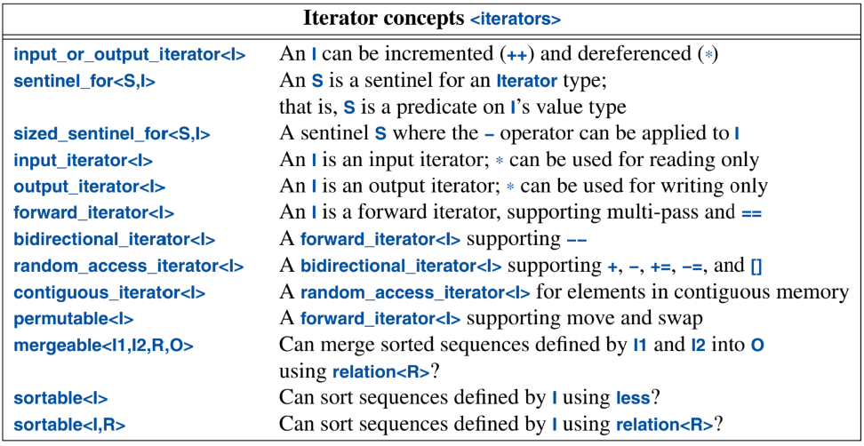
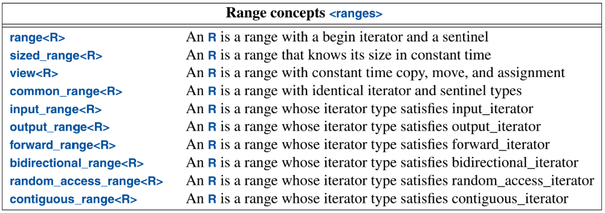
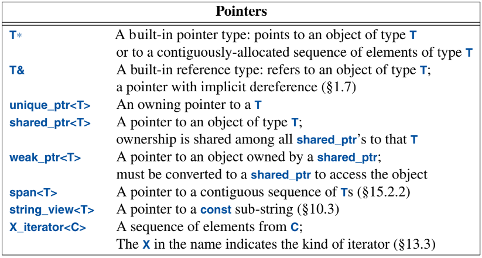

# A Tour of C++ (Stroustrup) — Ch. 14: Ranges

---

A `range` is a generalization of the C++98 sequences defined by `{begin(), end()}` pairs; it specifies what it takes to be a sequence of elements.

The algorithms that operated on ranges are essentially **constrained** (concept) versions of the "unconstrained" algorithms that take `begin()` and `end()` iterators for a sequence of elements.

We can use ranges in our own algorithms like:

```cpp
template<forward_range R>
    requires sortable<iterator_t<R>>
void my_sort(R& r)   // modern, concept-constrained version of my_sort
{
    return my_sort(r.begin(), r.end());   // use the 1994-style (iterator-pair) sort
}
```

## Views

> "A view is a way of looking at a range."

For example:

```cpp
forward_range auto& r;
...
filter_view v {r, [](int x) {return x % 2;}}; // view (only) odd numbers from r
```

When reading from a `filter_view`, we read from the underlying range. If the value read matches the predicate, it is returned. Otherwise, `filter_view` tries again with the next element in the range.

There is also `take_view`, which "takes" only a specific number of values from a range:
```
forward_range auto& r;
...
filter_view v {r, [](int x) {return x % 2;}};
take_view tv {v, 100}; // view at most 100 elements of v
```

We could condense all of this down and use *unnamed* views:
```
// Print the first 100 odd numbers in r.  (x % 2 is truthy for ODD x, so filter keeps odds)
for (auto& x : take_view{ filter_view{ r, [](int x) { return x % 2; } }, 100 }) {
    cout << x << ' ';
}
```

Here are some of the commonly-used views in `ranges`:



**Note**: A view doesn't own its elements. It's not responsible for deleting the elements of its underlying range. So **a view must not outlive its range**.

## Generators

If a range needs to be generated on the fly, the standard library provides *generators* (essentially factories) for that purpose:



`empty_view` and `single_view` are useful for calling algorithms that operate on a view, when you have zero or one elements.

`iota_view` is useful for generating a simple sequence. And `istream_view` gives us a simple way of using `istream`s in range-`for` loops.

## Pipelines

To simplify both writing and reading multiple filters, we can pipe the results into each other. This allows us to read left-to-right, instead of reading inside-out in a nested manner.

Instead of:

```cpp
for (auto& x : take_view{ filter_view{ r, [](int x) { return x % 2; } }, 100 }) {
    cout << x << ' ';
}
```

we can write:
```cpp
auto odd = [](int x) { return x % 2; };
for (auto& x : r | views::filter(odd) | views::take(100)) {
    cout << x << ' ';
}
```

## Concepts Overview

**What this section is:** a *reference catalog* of the standard-library concepts -- the vocabulary for constraining templates. It's **not new machinery** (I already have that from the Concepts talk + Ch. 8: *a concept is just a compile-time `bool` predicate on a type*). It's a **glossary** -- skim it, recognize the pattern, look up specifics when a compiler error names one. **Don't memorize the list.**

The concepts come in three buckets:

| Bucket | Examples | Answers |
|---|---|---|
| **Type concepts** (`<concepts>`) | `same_as`, `convertible_to`, `common_with`, `equality_comparable`, `totally_ordered`, `movable`, `regular` | "how do these types *relate* / behave?" |
| **Iterator concepts** | `input_iterator` → … → `random_access_iterator` → `contiguous_iterator` | "how *powerful* is this iterator?" (the Ch. 13 ladder) |
| **Range concepts** | `range`, `forward_range`, `view`, `sortable` | "can I treat this as a sequence, and do what to it?" |

**The ones actually worth recognizing** (the rest is library plumbing -- look it up on demand):
* **Value-type behavior:** `movable`, `copyable`, `semiregular` (default-construct + copy), and **`regular`** = `semiregular` + `equality_comparable` -- the gold-standard "well-behaved value type." *If I learn one, it's `regular`.*
* **Comparison:** `equality_comparable` (`==`), `totally_ordered` (`< <= > >=`).
* **Type relationships:** `same_as`, `convertible_to`, `derived_from`, `common_with`.
* **Callables:** `invocable`, `predicate` (callable returning `bool`).
* **Iterators/ranges:** the iterator ladder + `range` / `forward_range` / `view` / `sortable`.

**Mental filter:** almost all day-to-day constraining is two questions -- *"is this a `regular` value type?"* and *"how strong is this iterator/range?"* Nail those two axes and the firehose becomes a drip.

> Nuance: a concept fully checks the **syntactic** requirements (do these expressions *compile*?) but only *declares* the **semantic** ones (that `<` is a real ordering, `==` a real equality). The compiler can't verify semantics -- that's a promise *I* keep. A concept guarantees an operation *exists and compiles*, not that it's *correct*.

The concepts are grouped as type concepts, iterator concepts, and ranges concepts.

### Type Concepts

There are many exciting concepts for managing types and the relationships among types:



Many algorithms should work with combinations of related types. For example, we should be able to sort a mixture of `int`s and `double`s.

We can use `common_with` to say whether such a mix is sound.

```cpp
std::common_type_t<std::string, const char*> s1 = some_fct();
std::common_type_t<std::string, const char*> s2 = some_other_fct();
if (s1 < s2) {
    //  ...
}
```

**The "huh" -- two similarly-named things doing different jobs:**
* **`std::common_type_t<T, U>`** is a **type trait** → it *produces a type*: the common type both `T` and `U` convert to. `common_type_t<string, const char*>` **is `string`** (because `const char*` → `string`). That's why `s1`/`s2` are declared as that type.
* **`std::common_with<T, U>`** is a **concept** → a *bool*: "do `T` and `U` *have* a sensible common type?" `common_with<string, const char*>` is `true`.

So: **`common_with` = the gate (a bool); `common_type_t` = the tool it lets you use (the type to convert both sides to).** The motivation is exactly the "sort a mix of `int` and `double`" case -- to operate on two different-but-related types you bring them to their common type first, and `common_with` is how a generic algorithm *requires* that mixing to make sense.



> "The use of both equality_comparable_with and equality_comparable shows a (so far) missed opportunity to overload concepts."

**Decoded:** there are two sibling concepts for the same idea at different arities:
* `equality_comparable<T>` -- **one** type: is `a == b` valid where both are `T`? (homogeneous)
* `equality_comparable_with<T, U>` -- **two** types: is `a == b` valid where `a` is `T`, `b` is `U`? (heterogeneous)

Ideally you'd write **one name** and let it take either one or two arguments -- the way **functions overload on arity**. But **C++ concepts cannot be overloaded**: a concept name must be unique, so you *can't* have `equality_comparable<T>` and `equality_comparable<T,U>` share a name. The library was therefore *forced* to invent the separate `..._with` name. That **language limitation** -- not a design choice they liked -- is the "missed opportunity." (`equality_comparable_with<T, T>` is basically the one-type case, so `_with` is the general form; they just couldn't fold it under one name.)

## Iterator Concepts

There are also concepts to classify properties of iterator types:



The book highlights the `sentinel_for` concept -- and yes, it's a useful one to know.

**`sentinel_for<S, I>`** means: type `S` is a valid **sentinel** (end-marker) for iterator `I` -- i.e. `it == s` is a valid way to detect "the end." The key idea (straight from the Ranges CppCon notes): a range's end need **not** be an iterator of the same type as `begin` -- it can be *any* type you can compare the iterator against. That's what makes lazy/infinite ranges possible: **the end is a *condition*, not a position.** The `Sentinel` example below is a custom end-marker meaning "stop when the iterator points at a given character."

Here is some example code:
```cpp
template<class Iter>
class Sentinel {
public:
    Sentinel(int ee): end(ee) {}
    Sentinel(): end(0) {}   // Concept sentinel_for requires a default constructor
    friend bool operator==(const Iter& p, Sentinel s) { return (*p == s.end); }
    friend bool operator!=(const Iter& p, Sentinel s) { return !(p == s); }
private:
    iter_value_t<const char*> end;   // the sentinel value
};

const char aa[] = "Hello, World!\nBye for now\n";
ranges::for_each(aa, Sentinel<const char*>('\n'), [](const char x) { cout << x; });
```

What it does: `for_each` walks `aa` and, at each step, checks `iterator == Sentinel('\n')`, which is `*p == '\n'`. So it prints characters **until the first newline** → outputs `Hello, World!` and stops. The sentinel is a *"stop when you see this value"* condition -- **not** a one-past-the-end pointer. That's the whole point: sentinels let "the end" be a rule, which is exactly how ranges support infinite/lazy sequences (e.g. `iota_view` with no upper bound + a sentinel that says when to stop).

## Range Concepts

Range concepts define the properties of ranges:



`range` and `view` are indeed the two worth knowing.

**And yes -- good catch: a `view` IS a `range`.** The `view` concept *refines* `range`: a view is a range **plus** two extra promises -- it's **non-owning** and **cheap (O(1)) to copy/move**. So:

* every `view` is a `range`; **not** every `range` is a `view` (a `vector` is a range but not a view -- it *owns* its elements and is expensive to copy).
* that's why a view fits **anywhere a range is expected** -- pipe it into another adaptor, `for`-loop over it, hand it to a range algorithm.

(Agreed it should've been said up front -- it's the whole reason `r | views::filter(...) | views::take(...)` chains: each stage produces a *view*, which *is* a *range*, so the next stage happily accepts it.)

---

# A Tour of C++ (Stroustrup) — Ch. 15: Pointers and Containers

---

## Pointers

A *pointer* is something that allows us to refer to an object and to access it according to its type. There are many types of pointers.



Important notes that the book highlights:

> "Use owning pointers to objects allocated on the free store."

I intentionally try to avoid using `shared_ptr` and `weak_ptr`, because then it's not clear exactly which pointer is the owner of the object.

(Reasonable default -- prefer `unique_ptr` for a *single, clear owner*. Two refinements: use `shared_ptr` only when ownership is *genuinely* shared (lifetime really is jointly controlled). And `weak_ptr` is actually the tool that *clarifies* non-ownership -- a non-owning observer of a `shared_ptr`, used to **break reference cycles** (two `shared_ptr`s pointing at each other never reach refcount 0 → leak). So `weak_ptr` isn't an ownership muddle; it's the *fix* for one.)

> "Leave pointer arithmetic to the implementation of resource handles (such as `vector`s and `unordered_map`s)."

**Decoded:** don't do raw pointer arithmetic (`p + i`, `++p`, `*(p + i)`) yourself in application code -- that's where off-by-one and buffer-overrun bugs live. Instead, use containers' safe interfaces (`v[i]`, iterators, range-`for`), and let the *container's implementation* do the actual pointer math internally. So yes -- `vector`/`unordered_map`/`span` are exactly the well-tested code where pointer arithmetic *should* live; your code stays at the safe, high-level interface. It's about **confining** the dangerous low-level math to a few audited resource-handle implementations, not sprinkling it everywhere.

> "`string_view`s and `span`s are kinds of non-owning pointers.

That actually makes sense, since a `string_view` is just a view into a string, not owning the underlying data, and it can be iterated over.

### `unique_ptr` and `shared_ptr`

`unique_ptr` represents unique ownership, and its destructor destroys its object. `shared_ptr` represents shared ownership, and the last shared pointer's destructor destroys the object (reference-counted).

Keep in mind that we can use `make_shared<T>()` and `make_unique<T>()` instead of calling `std::unique_ptr<T>(new T())`.

**Why prefer `make_*`:** (1) **exception safety** -- no naked `new` whose result could leak if something else in the same expression throws before the smart pointer is constructed; (2) `make_shared` does a **single allocation** for the object *and* its control block (vs. two allocations for `shared_ptr(new T)`); (3) less typing, no repeated type name. Rule: prefer `make_unique`/`make_shared`; only use the raw-`new` form when you need a custom deleter.

> When we refer to a polymorphic object in classical object-oriented code (§5.5), we need a  pointer (or a reference) because we don’t know the exact type of the object referred to (or  even its size), so a `unique_ptr` becomes the obvious choice.

### `span`

A `span` from `<span>` is essentially a (pointer, length) pair denoting a sequence of elements.

This is especially useful in places where we would have passed an array and a count. For example:

```cpp
void fpn(int* p, int n)   // old style: pointer + separate count
{
    for (int i = 0; i < n; ++i)
        p[i] = 0;
}
```

becomes:

```cpp
void fs(span<int> p)   // span carries pointer + length together
{
    for (int& x : p)
        x = 0;
}
```

## Containers

### `array`

An `array`, defined in `<array>` is a fixed-size sequence of elements of a given type where the number of elements is specified at compile time.

It is a safer version of a built-in array. It does *not* have to be initialized with an initializer list -- `array` is an aggregate, so you *may* brace-init it, but otherwise it will default-initialize the elements. Here is example code of `array` providing more safety than a built-in array:

```cpp
void h()
{
    Circle a1[10];
    array<Circle,10> a2;
    //  ...
    Shape* p1 = a1;   // OK: disaster waiting to happen
    Shape* p2 = a2;   // error: no conversion of array<Circle,10> to Shape* (Good!)
    p1[3].draw();     // disaster
}
```

**Why `p1[3]` is a "disaster":** `a1` (a built-in array) **decays** to a `Circle*`, which converts to `Shape*` (Circle derives from Shape). But `p1[3]` = `*(p1 + 3)` does pointer arithmetic in strides of **`sizeof(Shape)`**, while the real elements are spaced **`sizeof(Circle)`** apart (Circle is bigger). So `p1[3]` lands at the *wrong address* -- garbage / UB. `std::array` **does not decay to a pointer**, so `Shape* p2 = a2;` is a *compile error* -- the bug simply can't be written. That's the safety win (and it's the "don't store polymorphic objects by value in a container" rule from Ch. 12, enforced at compile time).

### `bitset`

Class `bitset<N>` provides operations on a sequence of N bits.

### `pair`

The `pair` container is useful for functions that need to return two values. This is often the case when we want to return a value **or** an error code.

For example:

```cpp
pair<Entry*, Error_code> complex_search(vector<Entry>& v, const string& s)
{
    Entry* found = nullptr;
    Error_code err = Error_code::found;
    //... search for s in v...
    return {found, err};
}

...

auto [ptr, success] = complex_search(entry_table, s);
```

### `tuple`

Sometimes we want to treat a **sequence** of elements as a single object. `tuple` is a generalization of `pair` with zero or more elements.

```cpp
tuple t0 {};                                     // empty
tuple<string,int,double> t1 {"Shark",123,3.14};  // type explicitly specified
auto t2 = make_tuple(string{"Herring"},10,1.23); // type deduced to tuple<string,int,double>
tuple t3 {"Cod"s,20,9.99};                        // type deduced to tuple<string,int,double> (CTAD)

// access by index:
string fish  = get<0>(t1);   // first element:  "Shark"
int    count = get<1>(t1);   // second element: 123
double price = get<2>(t1);   // third element:  3.14

// access by type (works only because each type appears once):
auto fish2  = get<string>(t1);  // the string: "Shark"
auto count2 = get<int>(t1);     // the int:    123
auto price2 = get<double>(t1);  // the double: 3.14
```

## Alternatives

In addition to the built-in `union` type, the standard library provides three other types to express alternatives.

### `variant`

`variant<A,B,C>` is a safer and more convenient alternative to explicitly using a `union`. We can check the type of the held value with `holds_alternative<T>()`, and we can get the held value with `get<T>()`.

If we try to access a `variant` holding a different type from the expected one, `bad_variant_access` is thrown.

### `optional`

`optional` is useful for functions that may or may not return an object. It's essentially like defining a nullable type.

> "An `optional` is treated as a pointer to its object rather than the object itself.

This allows us to use `*` for object access.

### `any`

An `any` can hold an arbitrary type and know which type (if any) it holds. It is essentially an unconstrained version of `variant`.

We can later extract the type with casting:

```cpp
any m;
...
string& s = any_cast<string&>(m); 
```

If we try to access an `any` holding a different type than the expected one, `bad_any_access` is thrown.

This does not sound like a good thing to use... `any` is a rare escape hatch. When the set of possible types is *known*, prefer `variant` (type-checked, usually no heap allocation). Only reach for `any` only when the type genuinely can't be known at compile time -- e.g. a plugin/message boundary. Most code never needs it. Quick contrast: `variant` = one of a **fixed, known** set of types; `any` = **literally any** type, checked at runtime; `optional` = a value **or nothing** of **one** type.
