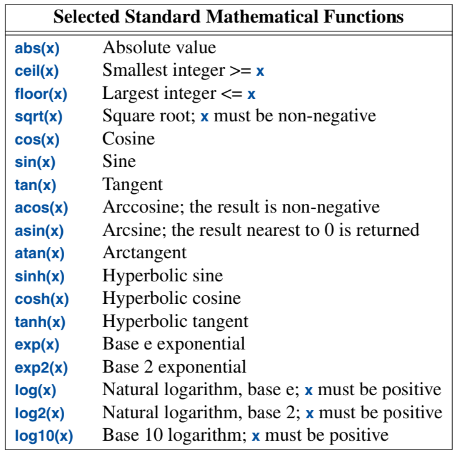
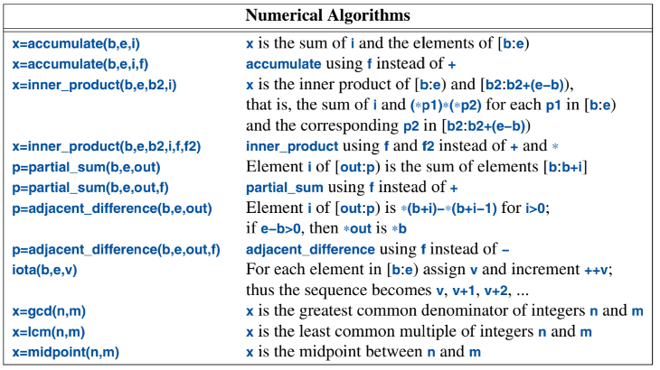

# A Tour of C++ (Stroustrup) — Ch. 16: Utilities

---

## Time

The `<chrono>` package provides time-based functionality, including:
* Clocks, `time_point`, and `duration` for measuring how long some action takes.
* `day`, `month`, `year`, and `weekday`
* `time_zone` and `zoned_time` for dealing with different time across the globe.

### Clocks

`std::chrono` provides us with functionality for calculating durations:

```cpp
using namespace std::chrono;              // sub-namespace std::chrono; see §3.3
auto t0 = system_clock::now();
do_work();
auto t1 = system_clock::now();
cout << t1 - t0 << "\n";                                        // default unit: e.g. 20223[1/100000000]s
cout << duration_cast<milliseconds>(t1 - t0).count() << "ms\n"; // specify unit: 2ms
cout << duration_cast<nanoseconds>(t1 - t0).count() << "ns\n";  // specify unit: 2022300ns
```

### Calendars

We can support all sorts of calendar-based dates:

```cpp
auto spring_day = April/7/2018;
cout << weekday(spring_day) << '\n';
cout << format("{:%A}\n", weekday(spring_day));
```

That would print:
```
Sat
Saturday
```

**Note to self:** verified — this compiles and prints `Sat`/`Saturday` as written. `weekday(spring_day)` works directly because a `year_month_day` implicitly converts through `sys_days` (the serial day-count) to a `weekday`.

### Time Zones

The std library now provides support for time zones:

```cpp
auto tp = system_clock::now();               // tp is a time_point
cout << tp << '\n';                          // 2021-11-27 21:36:08.2085095
zoned_time ztp {current_zone(), tp};
cout << ztp << '\n';                         // 2021-11-27 16:36:08.2085095 EST
const time_zone* est = locate_zone("Europe/Copenhagen");
cout << zoned_time{est, tp} << '\n';         // 2021-11-27 22:36:08.2085095 GMT+1
```

Note that you don't *construct* a `time_zone` from a string — you look one up with `std::chrono::locate_zone("...")`, which hands back a `const time_zone*`.

## Function Adaption

When passing a function as a function argument, the types must match **exactly**. If they almost match, we can typically adjust it using:
* Lambdas
* `std::mem_fn()` to make a function object from a member function
* Update the function to accept `std::function`

### Lambdas As Adaptors

Lambdas are often needed when working with iterators over a container:

```cpp
void draw_all(vector<Shape*>& v) {
    for_each(v.begin(), v.end(), [](Shape* p) { p->draw(); });
}
```

### `mem_fn()`

Given a member function, `mem_fn(mf)` produces a function object that can be called as a nonmember function:

```cpp
void draw_all(vector<Shape*>& v) {
    for_each(v.begin(), v.end(), mem_fn(&Shape::draw));
}
```

### `function`

We can define a function object like:

```cpp
int f1(double);
function<int(double)> fct {f1};

int f2(string);
function fct2 {f2};

function fct3 = [](Shape* p) { p->draw(); };
```

This is useful for callbacks, for passing operations as arguments, and for passing function objects. However, it may introduce run-time overhead (type erasure → an indirect call, and possibly a heap allocation for large callables).

## Type Functions

A *type function* is a function that is evaluated at compile time, taking a type as its argument and/or returning a type. For example:

```cpp
constexpr int szi = sizeof(int);
// ...
bool b = is_arithmetic_v<X>;              // true if X is one of the (built-in) arithmetic types
using Res = invoke_result_t<decltype(f)>; // Res is int if f is a nullary function returning int
// ...
template<typename T>
using Store = conditional_t<(sizeof(T) < max), On_stack<T>, On_heap<T>>;
```

Note `conditional_t` takes **angle brackets**, not parentheses: `conditional_t<cond, A, B>`, not `conditional_t(cond, A, B)`.

## `source_location`

`source_location` is the standard-library way of doing `__FILE__` / `__LINE__` / `__func__` (and it's a real object, not a macro):

```cpp
void log(const string& mess = "",
         const source_location loc = source_location::current()) {
    cout << loc.file_name() << '(' << loc.line() << ':' << loc.column() << ") "
         << loc.function_name() << ": "
         << mess;
}
```

## `move()` and `forward()`

The choice of moving vs. copying is typically implicit — the compiler prefers to move when an object is about to be destroyed. But sometimes we have to be explicit.

```cpp
void f1() {
    auto p = make_unique<int>(2);
    // auto q = p;       // ERROR: cannot copy a unique_ptr
    auto q = move(p);    // OK: transfers ownership; p is now nullptr
}
```
*(The two `auto q = …` lines are alternatives — the first shows what fails, the second what to do instead. Can't have both; it'd be a redeclaration.)*

Forwarding arguments is an important use case that requires moves.

> The standard-library `forward()` differs from the simpler `std::move()` by correctly handling subtleties to do with lvalue and rvalue (§6.2.2). Use `std::forward()` exclusively for forwarding, and don't `forward()` something twice; once you have forwarded an object, it's not yours to use anymore.

- **`move(x)`** = an **unconditional** "you may steal from `x`," no matter what `x` was.
- **`forward<T>(x)`** = **conditional** — it steals **only if** what the caller originally handed in was a temporary. Otherwise it copies.

**The dumbed-down "middleman" version (the one that stuck):**

A `wrapper`/middleman function just takes something and hands it to another function. I want it **transparent**:
* I gave it a **named variable I still need** → it should **copy** (leave mine alone).
* I gave it a **throwaway temporary** → it should **move** (steal it — faster, nobody's hurt).

The catch: once my argument is *inside* the middleman with a name (`x`), C++ **forgets** it started life as a temporary. A thing with a name looks like "someone might still want this" → copy. So:

| middleman does… | I pass a **named var** | I pass a **temporary** |
|---|---|---|
| pass `x` along (plain) | COPY ✓ | **COPY ✗** (wasteful) |
| `move(x)` (always steal) | **MOVE ✗** (stole my var!) | MOVE ✓ |
| `forward<T>(x)` | COPY ✓ | MOVE ✓ |

**Only `forward` gets both right.** `move` over-corrects (robs a variable I still need); plain pass-through under-corrects (needlessly copies a throwaway).

**Courier analogy:** `forward` is a courier that passes my package along *exactly as disposable as I marked it* — "keep safe" (named var) → copies; "toss when done" (temporary) → moves. `move` guts *every* package; plain pass-through gift-wraps a fresh copy of *every* package.

*(The scary "`T&&` where `T` is deduced" just means: that special template parameter secretly records "named or temporary?", and `forward<T>` replays the recording. I don't need the mechanics — just "the param remembers, `forward` replays it.")*

**Why "don't forward twice / it's not yours after":** because `forward` *might* move (when it was an rvalue), you must treat the object as **moved-from** afterward — valid but hollowed out. **Same rule as after `move`** — this is the moved-from-object-is-empty lesson from the Rule of Five, showing up again.

**Rule of thumb:** `move` = *"I'm done with this, steal it."* `forward<T>` = *"pass this through my template exactly as I received it."*

---

# A Tour of C++ (Stroustrup) — Ch. 17: Numerics

---

Numeric computation is valuable for various operations, such as scientific computation, database access, graphics, simulation, or financial analysis.

## Mathematical Functions

From `<cmath>` we get the usual suspects — `sqrt`, `pow`, `exp`, `log`/`log10`, `sin`/`cos`/`tan`
(+ their inverse/hyperbolic variants), `ceil`/`floor`/`round`, `fabs`, `fmod`, etc. — for `float`,
`double`, and `long double`. (Integer `abs` is over in `<cstdlib>`.)



Errors are reported the **clunky, legacy way** — through the global `errno` (`<cerrno>`): a *domain*
error (bad input, e.g. `sqrt(-1)`) sets `EDOM`; a *range* error (result too big, e.g. overflow) sets
`ERANGE`.

```cpp
errno = 0;
double d = sqrt(-1);
if (errno == EDOM)
  ...  // domain error

errno = 0;
double dd = pow(numeric_limits<double>::max(), 2);
if (errno == ERANGE)
  ...  // overflow
```

**Note to self:** `errno` is a global you must zero *before* the call and check *after* — a C
holdover, awkward and easy to forget. Not modern style.

**Special math functions** (C++17, also in `<cmath>`): the fancy analysis ones — `beta`,
`legendre`, `riemann_zeta`, Bessel functions, etc. Niche, but standard now.

## Numerical Algorithms

`<numeric>` = fold/scan-style algorithms over a range:

* `accumulate(b, e, init)` — sum, or fold with a custom op.
* `inner_product(b, e, b2, init)` — dot product.
* `partial_sum` / `adjacent_difference` — running totals / element-to-element deltas.
* `iota(b, e, start)` — fill with `start, start+1, start+2, …` (same `iota` idea as the ranges view).
* **C++17 additions:** `reduce` (like `accumulate` but **unordered** → parallelizable),
  `transform_reduce` (map-then-fold), `exclusive_scan`/`inclusive_scan` (prefix sums), and
  `gcd`/`lcm`.



```cpp
reduce(v.begin(), v.end());                          // 10 for {1,2,3,4}     (verified)
transform_reduce(v.begin(), v.end(), 0,
                 plus<>{}, [](int x){ return x*x; }); // sum of squares = 30  (verified)
gcd(12, 18);  // 6      lcm(4, 6);  // 12             (verified)
```

Most take an **execution policy** first argument (`std::execution::par`, …) for parallel/vectorized
runs — the range is then processed in an **unspecified order**. That's *why* `reduce` exists as the
order-independent sibling of `accumulate`: reassociating a sum is only safe if order doesn't matter.

## Complex Numbers

`std::complex<T>` (`<complex>`), templated on the scalar (`float`/`double`/`long double`). Full
arithmetic plus the usual functions (`abs`, `arg`, `norm`, `conj`, `polar`, `sqrt`, …).

```cpp
complex<double> c{3, 4};
abs(c);   // 5   (verified — the classic 3-4-5 magnitude)
```

## Random Numbers

**The key idea Stroustrup hammers: a random number = an `engine` + a `distribution`.**

* **Engine** = the raw pseudo-random *bit source*. E.g. `default_random_engine`, `mt19937`
  (Mersenne Twister). You **seed** it.
* **Distribution** = shapes those raw bits into the numbers you actually want, over a range/shape.
  E.g. `uniform_int_distribution`, `uniform_real_distribution`, `normal_distribution`,
  `bernoulli_distribution`.

Wire them together and call the distribution **with** the engine:

```cpp
mt19937 eng{12345};                        // engine, seeded (reproducible)
uniform_int_distribution<int> die{1, 6};   // distribution
int roll = die(eng);                       // e.g. 6 6 2 1 2 …   (verified)
```

Stroustrup's tidy pattern — wrap the pair so callers just do `rnd()`:

```cpp
class Rand_int {
    default_random_engine re;
    uniform_int_distribution<> dist;
public:
    Rand_int(int lo, int hi) : dist{lo, hi} {}
    int operator()() { return dist(re); }
};
```

**Note to self:** this is the grown-up replacement for `rand()` — no modulo bias, real
distributions, seedable/reproducible. Reach for `<random>`; never `rand() % n`.

## Vector Arithmetic

`std::valarray<T>` (`<valarray>`) — a numeric array built for **element-wise** math: an expression
like `a * 2.0 + 1.0` applies to *every* element at once, plus `slice`/`gslice` for strided
(matrix-like) access.

```cpp
valarray<double> a{1, 2, 3};
a = a * 2.0 + 1.0;   // -> {3, 5, 7}   (verified)
```

**Note to self:** `valarray` is the neglected corner of the library — meant for math-heavy code but
never really caught on (people use `std::vector` + a library like Eigen instead). Know it exists;
don't expect to see it in the wild.

## Numeric Limits, Type Aliases, Mathematical Constants

* **`numeric_limits<T>`** (`<limits>`) — properties of a type: `max()`, `epsilon()` (the smallest
  `x` where `1 + x != 1`), `infinity()`, `digits10`, etc.
  ```cpp
  numeric_limits<double>::max();      // 1.79769e+308   (verified)
  numeric_limits<double>::epsilon();  // 2.22045e-16    (verified)
  ```
  **⚠️ Note to self — the classic trap:** for a **floating-point** type, `min()` is the smallest
  *positive normal* value, **NOT** the most negative one. For "most negative," use **`lowest()`**.
  (For integers, `min()` *is* the most negative — that very inconsistency is why `lowest()` was
  added.)

* **Fixed-width type aliases** (`<cstdint>`): `int8_t`/`int16_t`/`int32_t`/`int64_t` (+ `uint…`) for
  *exact* widths; `int_fast32_t` / `int_least32_t` for "at least this many bits, optimized for
  speed/size." Use these when width actually matters (wire protocols, file formats) instead of
  assuming `int` is 32 bits.

* **Mathematical constants** (`<numbers>`, **C++20**): `std::numbers::pi`, `::e`, `::sqrt2`,
  `::ln2`, `::phi`, … — finally, *typed* constants instead of `#define M_PI` or hand-rolled literals.
  ```cpp
  numbers::pi;  // 3.14159…   (verified)
  numbers::e;   // 2.71828…   (verified)
  ```