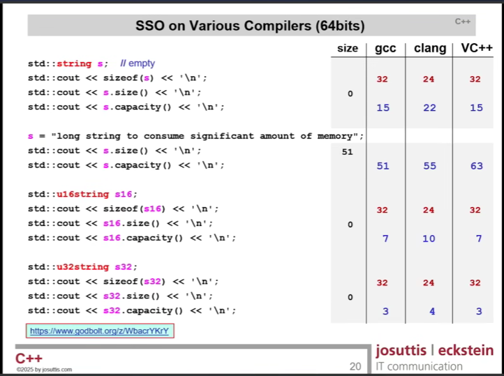
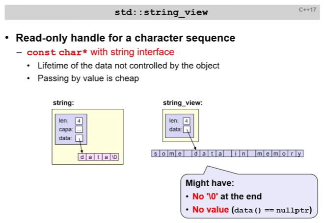
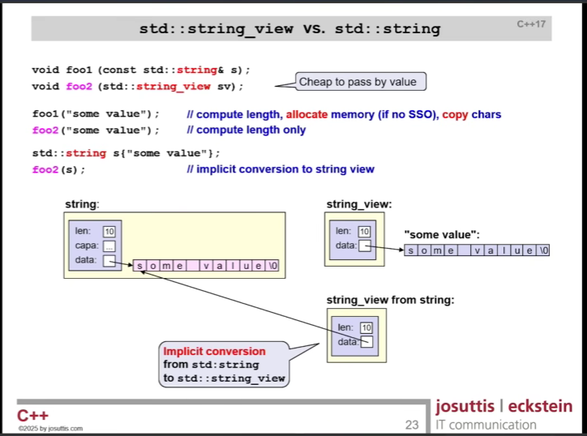
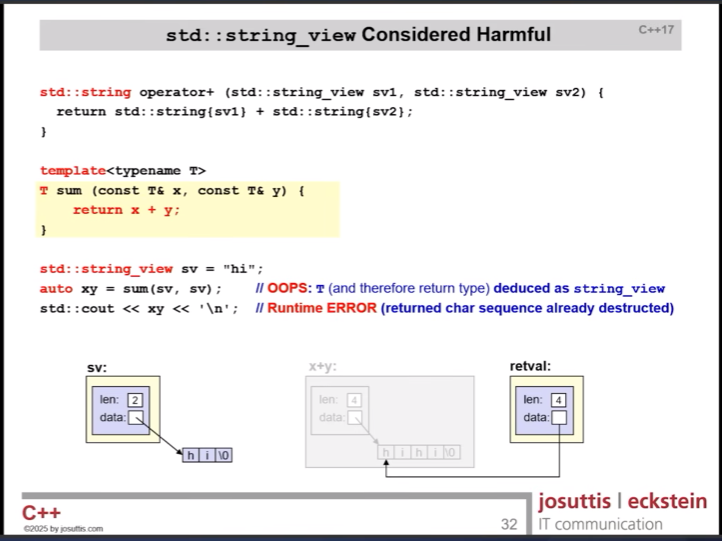

# CppCon 2025 — Back to Basics: C++ Strings and Character Sequences (Nicolai Josuttis)

---

## Character Types

A read-only string literal is a const char array, including the `'\0'` at the end. It can be **used** like a character pointer. 

In C++, we have `std::string`, a **class type**. It's a dynamic sequence of character, it is mutable, and it can be empty.

We also have `std::string_view` (since C++17). It's a pointer to a character sequence **with size**.

So some consequences of all this... this is a pointer being **initialized** from the character array:

`const char* p = "hi"`

## Raw String Literals

`"\"\\n\""` is the same as `R"("\n")"`.

You can actually set up to 16 basic characters for the delimiter, aside from parenthesis, backslash, and whitespace. So we could do:

```cpp
auto s4 = R"qq("jim qq")qq";   // delimiter is qq; content is:  "jim qq"
```

### Small / Short String Optimization (SSO)

Most string literals are short. 8 or 10 or 20 characters are short. So what we do is the `std::string` automatically has a short `data` area within it. And for short strings, that's where we store the string. If it's longer than that area, we allocate memory on the heap... and then we store the **memory address** in the `data` area.

Not surprisingly, different compilers have different implementations of `std::string` and SSO. So as a result, some compilers will be more efficient than others for different sized strings. Clang is able to handle longer strings before it shifts the string data to a separate heap memory area:



## `std::string_view`

It has a read-only handle for a character sequence. Keep in mind that the lifetime of the data is not controlled by the object. Also, **it does not have a null-terminator**.



So this can significantly increase performance. For example:



A cool benefit is that there's no reason to pass-by-reference with `std::string_view`. `const std::string_view&` won't be faster than `std::string_view`.

"`string_view` is like raw pointers, but with a `string`-like API."

**Note: Don't return a `string_view` into data that's about to die!**



A `string_view` is just a `{pointer, length}` into someone else's buffer -- it doesn't own the data. So the danger is a **dangling pointer**: if that buffer dies, the view points at freed memory.

```cpp
std::string_view bad() {
    std::string s = "café";
    return s;          // ❌ DANGLES -- s is destroyed, view points to freed bytes
}

std::string_view ok() {
    return "café";     // ✅ points to a string literal -- lives forever
}
```

## Internationalization

With text, there are actually **three separate ideas** that I keep mashing together:

| Idea | What it is | Example |
|---|---|---|
| **Character** | what a human sees | `A`, `é`, `€`, `😀` |
| **Code point** | the *number* Unicode assigns it | `A`=U+0041, `é`=U+00E9, `😀`=U+1F600 |
| **Encoding** | how that number becomes *bytes* | UTF-8, UTF-16, UTF-32 |

**Unicode** is just the lookup table from character → number (code point). It says nothing about bytes. The **encoding** is the separate step that turns code points into actual bytes.

### The three encodings

* **UTF-8** -- variable width, **1 to 4 bytes** per code point. ASCII stays 1 byte and is byte-identical to old ASCII (that's why it's backward-compatible). Dominant on the web / in files.
* **UTF-16** -- 2 bytes for most, 4 for the rest (emoji, etc.). Windows / Java / JS internally.
* **UTF-32** -- always 4 bytes. Fixed width, so O(1) indexing by code point, but wastes space.

### Why iterating/indexing on UTF-8 is hard

Because UTF-8 is variable-width, we **can't** jump to byte 10 to get character 10 -- we have to walk from the start, decoding as we go (O(n), not O(1)).

Worse: even "one character" is fuzzy. A **grapheme cluster** (what a human sees as one character) can be several code points -- `é` might be one code point (U+00E9) *or* two (`e` + a combining accent). So "the Nth character" is genuinely ambiguous, not just slow.

### How does `std::string` "support" UTF-8?

**`std::string` is just a sequence of bytes (`char`) -- it has no idea what encoding it holds.**

```cpp
std::string s = "café";   // saved as UTF-8 → 5 BYTES: c a f 0xC3 0xA9
s.size();    // 5, NOT 4   -- é is two bytes
s[3];        // 0xC3 -- half of the é, meaningless on its own
```

So "how do I get `std::string` to support UTF-8?" → **it already does.** I just store the UTF-8 bytes in it; there's no flag to flip. What it does *not* give me is anything Unicode-*aware*: `.size()` is bytes (not characters), `s[i]` is the i-th byte, and there's no code-point/grapheme iteration, normalization, or Unicode-aware case/sort.

The pragmatic approach ("**UTF-8 everywhere**"): keep everything as UTF-8 in a plain `std::string` and treat it as opaque bytes. Concatenation, equality, copying, and substring search all work correctly byte-wise (UTF-8 is self-synchronizing + ASCII-compatible). Only decode to code points for the rare op that truly needs it.

### C++20 type machinery

```cpp
char8_t          // C++20 -- one UTF-8 code unit (a byte)
char16_t/char32_t// one UTF-16 / UTF-32 code unit (char32_t == one code point)
std::u8string    // basic_string<char8_t>  (also u16string / u32string)
auto a = u8"café";  // UTF-8 literal  (const char8_t[] in C++20)
auto c = U"café";   // UTF-32 literal (1 element per code point)
```

Catch: even `std::u8string` gives me **almost no Unicode algorithms** -- no grapheme counting, normalization, or locale-aware case conversion. For real Unicode work I'd reach for **ICU**. Most code just uses `std::string` + UTF-8 bytes and only pulls in ICU when it actually has to manipulate characters.

> **One-liner:** Unicode *numbers* the characters; UTF-8 turns those numbers into 1–4 bytes each; `std::string` just holds those bytes and counts *bytes, not characters* -- which is why it's great for UTF-8 storage but can't tell me where the 10th character is.

