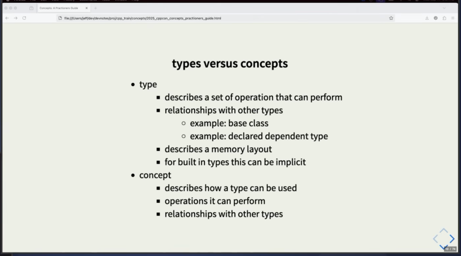

# CppCon 2025 — Back to Basics: Concepts (Jeff Garland)

---

## TL;DR

A **concept** is a *named, reusable, composable, compile-time **boolean predicate** on types (and values)*. You use it to **constrain templates**. Everything happens at compile time — **zero runtime cost**.

### Why they were added
- Write generic libraries that are **fast**, have **readable error messages**, and are **maintainable**.
- **Better interfaces**: more descriptive, with clearer dependencies.

---

## 1. What a concept *is*

A **boolean predicate on types and values**, evaluated entirely at **compile time**. Two new keywords: `concept` and `requires`. A concept can demand that a type provide:
- required methods / operators (i.e. certain expressions must be valid)
- required associated, sub-, or base types
- required semantics

### The canonical example

```cpp
namespace io {
    template<class T>
    concept printable = requires(std::ostream& os, T v) {
        v.print(os);          // "for a T v and an ostream, v.print(os) must be valid"
    };
}

class my_type {
    std::string s = "foo\n";
public:
    void print(std::ostream& os) const { os << "s: " << s; }
};

static_assert( io::printable<my_type> );   // it's just a compile-time bool
```

### The mental model that makes everything click

**A concept is just a `bool`.** Anywhere a compile-time bool is legal — `static_assert`, `if constexpr`, a `requires`-clause -- we can use a concept. That one fact demystifies most of the syntax.

### `requires` is two different things (don't conflate them)
- **requires-*expression*** — `requires(args){ ...; }` → *produces* a bool. Used to **define** a concept (the body of `printable` above).
- **requires-*clause*** — `requires printable<T>` → *applies* a constraint to a template/function (see §2).

### Structural / implicit satisfaction (the Go parallel)

Like Go interfaces, concepts are satisfied **structurally / implicitly** — `my_type` never declares "I am printable"; it just *has* a `print()`, and that's enough. No inheritance, no `implements`. That's the duck-typing parallel. (The big *difference* from Go is in §3 — it's a compile-time thing, not runtime.)



---

## 2. What a concept *does*

These are the practical uses. All of them lean on "a concept is just a compile-time bool."

### a. Constrain a template / overload set
Three equivalent ways to say "`T` must be `printable`":

```cpp
template<printable T> void f(T s);                 // constrained template parameter
template<class T> requires printable<T> void f(T s); // requires-clause
void f(printable auto s);                           // abbreviated function template
```

Add a second concept, then write **one overload per concept** — the compiler picks the overload whose constraint the argument satisfies. The concept *is* the selector:

```cpp
template<class T>
concept printable = requires(std::ostream& os, T v) { v.print(os); };

template<class T>
concept output_streamable = requires(std::ostream& os, T v) { os << v; };

void show(printable auto x)         { x.print(std::cout); }  // chosen if x has .print()
void show(output_streamable auto x) { std::cout << x; }      // chosen if x supports <<

show(my_type{});   // → printable overload
show(42);          // → output_streamable overload (int has <<, not .print())
```

That's what "pick themselves" means: each call resolves to the overload that fits, with no `enable_if` or tag dispatch. (Caveat: if a type satisfies **both** concepts, the call is ambiguous unless one concept *subsumes* the other — see §2e.)

### b. Constrain a deduced variable (`<concept> auto`)
A concept turns a bare `auto` into a *checked* `auto` — a bridge between "pure `auto`" and a specific type:

```cpp
printable auto s;                      // ❌ no initializer → nothing to deduce from
printable auto s2 = init_some_thing(); // ✅ deduce the type, then verify it's printable
```

### c. Select code at compile time with `if constexpr`
Because a concept is a bool, no `requires` syntax is needed here:

```cpp
template<class T>
void print_ln(const T& x) {
    if constexpr (printable<T>) {                 // does T have .print()?
        x.print(std::cout);
        std::cout << '\n';
    } else if constexpr (output_streamable<T>) {  // else, does T support <<?
        std::cout << x << '\n';
    } else {
        // fallback for types that are neither
    }
}
```
The branch not taken is **discarded** (same `if constexpr` rule from the [static/inline/const talk](2026-06-25-static-inline-const.md)), so each `T` compiles only the branch it uses.

### d. Conditionally enable a member of a class template
A `requires` clause on a member makes it **exist only when `T` supports it** — even though the member itself isn't a template. One class, capabilities that appear/disappear by type:

```cpp
template<class T>
struct Box {
    T value;
    void print() const requires printable<T> {   // only exists if T is printable
        value.print(std::cout);
    }
};

Box<my_type> b;  b.print();   // ✅ exists
Box<int> n;                   // n.print() ✗ — doesn't exist, with a clear error
```
This is the modern, readable replacement for old `std::enable_if`/SFINAE tricks.

### e. Compose constraints with `&&` / `||`
Build bigger constraints from smaller concepts:

```cpp
template<class T>
concept Number = std::integral<T> || std::floating_point<T>;   // disjunction

template<class T>
    requires std::integral<T> && std::copyable<T>              // conjunction
void f(T);
```
Payoff: **subsumption** — a more-constrained overload is automatically preferred. An algorithm on `random_access_iterator` wins over one on `forward_iterator` because the former *subsumes* (implies) the latter, so the compiler picks the most specific match with no manual tie-breaking.

### f. Better error messages
> "One of the promises of concepts is better errors."

A constraint failure says "`my_type` does not satisfy `printable`" instead of vomiting a 200-line template instantiation backtrace.

---

## 3. What a concept does *not* do

### ❌ No runtime polymorphism
This is the key distinction from Go. Concepts are **compile-time**, zero-cost; templates get monomorphized per type. Go interfaces are **runtime** dispatch (boxing + itable). So:
- C++ concepts ≈ *compile-time* structural typing (the static analog of a Go interface).
- The C++ tool for *runtime* dispatch — storing "any printable" in a container — is the **abstract base class + virtual functions** from Ch. 5, **not** concepts.

A concept gives interface-like *checking* without runtime indirection; it does **not** give you a heterogeneous container of "things that are printable."

### ❌ A constrained placeholder doesn't work everywhere
Verified with g++ 15.2 — `printable auto` is fine in a declarator, but **not** nested inside a template argument:

```cpp
const printable auto* m = new my_type();   // ✅ auto = my_type, checked against printable
const std::unique_ptr<printable auto> upm = std::make_unique<my_type>();  // ❌ ill-formed
// g++: error: invalid use of 'auto' in template argument
```
To say "a `unique_ptr` to something printable," constrain it elsewhere:

```cpp
std::unique_ptr<my_type> upm = std::make_unique<my_type>();   // name the type
template<printable T> void use(const std::unique_ptr<T>& p);  // or constrain a template param
```

### ❌ Not free to change
Compile-time means a concept is **hard to change without recompiling** everything that uses it — same trade-off as any compile-time interface.

---

## 4. Standard library concepts (reference)

Common ones (from `<concepts>`):
- `integral`, `signed_integral`, `unsigned_integral`, `floating_point<T>`
- `same_as<T,U>`, `derived_from<T,U>`, `convertible_to<T,U>`
- `equality_comparable<T>`, `equality_comparable_with<T,U>`, `totally_ordered<T>`

Garland says specifically learn these two — they say a type is **well-behaved** (copy/move/default-construct/compare like a built-in):
- `semiregular<T>` — default-constructible + copyable
- `regular<T>` — `semiregular` + `equality_comparable`

**Ranges** are built on concepts: as long as a type provides `begin()` and `end()`, it models `range` and the `<ranges>` algorithms work on it.

`std::view_interface` (advanced): a CRTP base for range *views* that **synthesizes boilerplate** (`empty()`, `front()`, `back()`, `operator[]`, `size()`, …) from your view's `begin()`/`end()`. The wall of `requires`/`constexpr` is just §2d at library scale — each default method is a constrained member that appears only when supported (`operator[]` if random-access, `size()` if sized, …). I just need to recognize the pattern, not write it.

---

## 5. Designing with concepts

- C++ is **multi-paradigm**: structured, functional, generic.
- Dividing a program creates **dependencies**, and the divided pieces have to be **recomposed** — concepts are the vocabulary for stating what the pieces require of each other.
- New failure modes over time:
  - a **type** evolves until it no longer models a concept, or
  - a **concept** evolves until a type no longer models it.

> "A lot of design is about variation between things… concepts give you a very powerful set of tools to express those variations."

---

## Summary

"Concepts are a way to constrain templates" is accurate, but it undersells them. Concepts are **named, reusable, composable compile-time predicates** on types/values, and constraining templates with them buys (1) far better errors, (2) overload selection via subsumption, (3) self-documenting interfaces, and (4) members/functions that switch on a type's capabilities — all at **zero runtime cost**.
