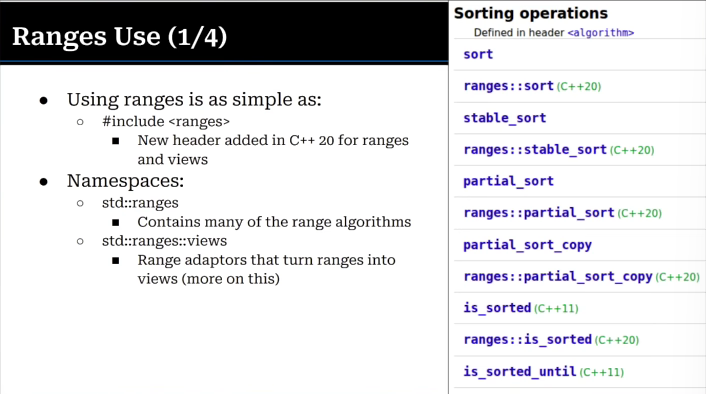

# CppCon 2025 — Back to Basics: Ranges (Mike Shah)

---

Historically we've had `for` loops:
```
for (std::size_t i =0; i < sizeof(message); i++) {
    std::print("{}", message[i]);
}
```

This can work with an `std::array` as well and calling `a.size()`, or with `std::string` and calling `s.length()`.

> Note to self: `sizeof(message)` only works as an element count *by accident* -- it's the size in **bytes**, which equals the count only for a `char`/1-byte array, and only before the array decays to a pointer. The real element count is `.size()` or `std::size(message)`.

You could also use **pointers** for iterating:

```cpp
std::array message {'H','e','l','l','o'};
auto data = &message.data()[0];
auto ptr = data;
auto end = data + message.size();

for ( ; ptr != end; ptr++) {
    ...
}
```

At some point, people decided we should want `std::begin()` and `std::end()` functions to get `iterator` objects for the array:
```cpp
auto ptr = std::begin(message);
auto end = std::end(message);
```

> "Iterators are a generalization of pointers..."

An iterator is an object that allows you to access elements in a collection. **Internally**, an iterator may be a pointer to a specific element, but we don't really care.

> ⚠️ **Correction to myself:** I wrote "an abstraction that provides RAII" -- that's wrong. Iterators have nothing to do with RAII (resource lifetime / destructors). An iterator is an abstraction for **uniform traversal/access** -- it gives every container the same interface so algorithms don't care what they're walking over. (RAII is the separate *resource-handle* idea from Tour Ch. 6.)

`std::end()` points **one past the last element** -- the half-open range `[begin, end)` convention. You never dereference `end`; an empty range is just `begin == end`; and the element count is `end - begin`. (Handling the empty case cleanly is one nice consequence.)

A perk of iterators is that they're **generic**. We can swap out from `std::array` to `std::vector`, and we can use the same algorithms.

Iterators are great, because we can progress through them with like `ptr++`.

## Benefits of Iterators

1. **Iterators are one of the behavioral design patterns**.
  * The "begin" and "end" pair more clearly the intent to iterate through the entire collection.
  * Generally speaking, it is easy to modify code, because the common interface for the iteration is otherwise the same.
2. **Iterators are powerful, because we decouple the "algorithm" from how we iterate.**
  * Decouples the traversal from the container.

## `std::algorithm`

By using iterators, we get access to various STD-lib algorithms:

* `std::sort`: Sort by some comparator.
* `std::partition`: Divide the data by some predicate.
* `std::copy`: Copy to a destination.
* `std::shuffle`: If you want to randomize data.
* `std::rotate`: Rotate the data "around the merry-go-round".
  * `std::rotate(std::upper_bound(v.begin(), i, *i), i, i+1);`
* `std::transform`: Apply a function to each element, writing results to an output range -- which *can* be the same range (in place) or a different one.

In general, the algorithms take two iterators and a predicate.

## Pitfalls

1. **Iterator invalidation**. If we have an iterator, and we perform some operation on the collection, the iterator may point to "invalid" memory.

```cpp
auto it = a.begin();   // (the original `a.begin()++` post-increments a temporary → no-op)
a.push_back(1);        // may reallocate the vector's buffer...
// it is invalid now!  // ...leaving `it` dangling into freed memory
```

2. **Wrong pair of iterators**. If you're dealing with two different collections, you could end up with unmatched pairs of `begin()` and `end()`.

3. **Consistency**. *Sometimes* the parameters on an algorithm are not first and last. For example, `rotate` takes first, middle, and last.

How can we improve on iterators?

## Ranges

**What is a range?** The classic intuition: a pair of iterators (begin + end). More precisely in C++20, a range has a **begin iterator** and an **end *sentinel*** -- and the sentinel need *not* be the same type as the iterator. That generalization is exactly what makes **lazy and infinite** ranges possible: the "end" can be a marker meaning "never stops" rather than a real position.

In C++20, we also got concepts, which helped make possible the ranges API:
```cpp
template<typename T>
concept range = requires(T& t)
{
    ranges::begin(t);
    ranges::end(t);
};
```



`range` versions of algorithms take one less parameter. So there's no risk of the mismatched `begin()` and `end()` that was mentioned with iterators.

If you really want, you can still do `std::ranges::begin(v)` and `std::ranges::end(v)`.

## Ranges Views

"Range adaptors" turn ranges into "views". Range Views (`std::ranges::views`) are "lazy" ways to access items in a range.

Range Views can execute lazily.
* Roughly speaking, copy & assignment takes place in O(1)
* This allows for infinite ranges
* The `std::views` allow for composition (with the pipe `|` syntax)

```cpp
std::vector v4{1,1,1,1,5,6,7,8,9,10,11};
auto greaterThanFive = v4 | std::views::filter([](int i){return i > 5;});
for (auto& elem : greaterThanFive) {
    std::cout << elem << " ";
}
```

`greaterThanFive` hasn't been already produced. Instead, it produces on-demand lazily!

> ⚠️ **Lifetime footgun (same as `string_view`):** a view does **not** own its elements -- it just refers to the underlying range (`v4` here). If `v4` is destroyed or modified (e.g. a reallocating `push_back`), the view **dangles**. Keep the source range alive for as long as the view is used.

If we want to store out to a collection, we can use `std::ranges::to`:

```cpp
std::vector v4{1,1,1,1,5,6,7,8,9,10,11};
std::vector<int> greaterThanFive = v4
    | std::views::filter([](int i){return i > 5;})
    | std::ranges::to<std::vector>();
```

> `std::ranges::to` is **C++23** (the rest of ranges is C++20). It's the bridge from a lazy view back to an owning container -- i.e., "materialize the results."
