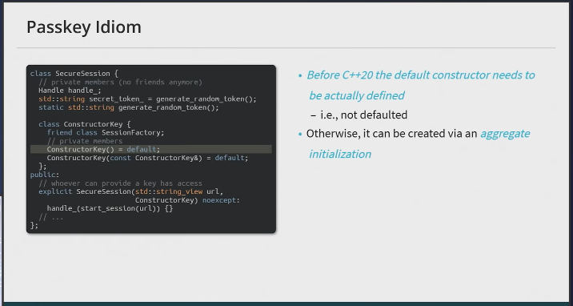
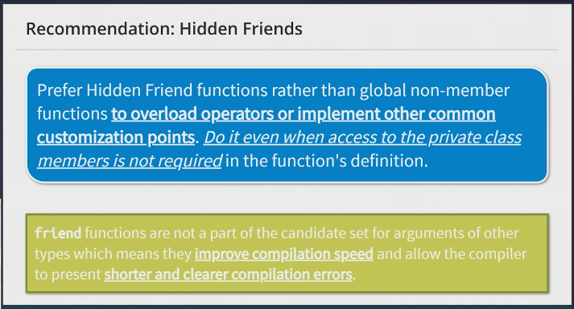

# CppCon 2025 — Back to Basics: Friendship (Mateusz Pusz)

---

## The one idea

`friend` lets a class **grant a specific, named outsider access to its private members**. The *author* chooses who gets in -- so it's a tool for handing out the **least** access necessary, not a loophole that widens access.

> The talk is really a tour of access tools, **broad → narrow**:
> **public getter/setter → `friend` class → passkey idiom → hidden friends.**
> Always pick the narrowest one that does the job.

I came in thinking "`friend` breaks encapsulation." By the end the point is the opposite: used well, `friend` is *more* encapsulating than the getter/setter reflex (§3).

---

## 1. What `friend` is

- A `friend` declaration grants a **non-member function**, **another class**, or **a specific member of another class** access to this class's `private`/`protected` members.
- It is **granted by the class, from the inside** -- you can't "take" friendship from outside.
- **Where you put the declaration doesn't matter.** A `friend` line in the `public`, `private`, or `protected` section means the same thing -- the friend isn't a member, so access specifiers don't apply to it.

```cpp
class my_int {
    int value_;
public:
    constexpr my_int(int value): value_(value) {}

    friend constexpr my_int operator+(my_int, my_int);  // declared friend...
};

constexpr my_int operator+(my_int lhs, my_int rhs) {    // ...defined outside
    return lhs.value_ + rhs.value_;                     // can touch value_
}
```

> Why not just a public `getValue()`? A getter would let **everyone** read `value_` and would bake "my_int is really an int" into the public interface -- change the representation later and every caller breaks. `friend` grants the access to **only** `operator+`. For a trivial type the value isn't secret so a getter is harmless, but the *principle* -- minimum access to exactly who needs it -- is what scales to real types.

---

## 2. The three properties (the gotchas)

Friendship is **not inherited, not transitive, not reciprocal** (C++ FAQ):

- **Not inherited** -- if `A` befriends `Base`, classes *derived from* `Base` are **not** friends of `A`.
- **Not transitive** -- a friend of a friend is not a friend. If `A` befriends `B` and `B` befriends `C`, `C` still has no access to `A`.
- **Not reciprocal** -- if `A` befriends `B`, then `B` can see `A`'s privates, but `A` can**not** see `B`'s (unless `B` also befriends `A`).

These keep friendship from silently spreading -- every grant is explicit and one-directional.

---

## 3. Does `friend` break encapsulation? (No -- it *is* the barrier)

> "A friend function ... doesn't violate encapsulation any more than a public member function." -- C++ FAQ

The sharper version (isocpp): used properly, **friends *enhance* encapsulation** -- "along with the class's member functions, they *are* the encapsulation barrier."

The getter/setter reflex is the real leak:

| | grants access to |
|---|---|
| public getter/setter | **everyone, forever** |
| `friend` | **one named collaborator** the author chose |

A getter/setter per field is encapsulation *theater* -- you've published the representation with boilerplate. Encapsulation is about the author **controlling** access; a `friend` is the author *exercising* that control. So expose **behavior** (what the object *does*, preserving its invariants), not **state** (what it *has*).

---

## 4. When you actually reach for it

### Symmetric operators
A symmetric `operator+` *must* be a **non-member** so both operands convert equally (the rule from Tour Ch. 6). A non-member that needs private data is exactly what `friend` is for -- see the `my_int` example in §1 (and the better, hidden-friend form in §6).

### Tightly-coupled collaborators (the bank example)
`int balance() const { return balance_; }` is a *read-only* getter -- fine. The danger is the **write** path. To implement `transfer`, you must *change* two accounts' `balance_`. A public **setter** would let *anyone* set *any* balance to *anything* -- destroying the invariant that a balance only moves via deposits/withdrawals/transfers (hello, fraud). Making `transfer` (or a `transaction` class) a `friend` lets **only** it adjust balances, with no public setter.

So the `bank_account` ↔ `transaction` `friend` link isn't weird: they form **one conceptual unit** where one needs privileged access to the other, while the public interface stays minimal.

---

## 5. Granting *less*: alternatives to full friendship

### Nested classes -- often no `friend` needed
```cpp
template <typename T>
class storage<T>::iterator {
    storage* st_;
public:
    explicit iterator(storage& st): st_(&st) {}
    iterator& operator++() {
        // can access storage's private members -- no friend needed
        return *this;
    }
};
```
A nested class (`storage<T>::iterator` defined *inside* `storage`) is a **member** of `storage`, so it automatically has access to the enclosing class's private members (since C++11). **Before reaching for `friend`, ask whether the helper can just be a nested class.**

### The passkey idiom -- friend a single *method*, not the whole class
Plain `friend class X` gives `X` access to **all** your privates. The passkey grants finer access: a tiny empty `Key` whose constructor is private and friends only the allowed callers; the method takes a `Key`, so only code that can *construct* a `Key` can call it.

```cpp
class Widget {
public:
    class Key {                // the passkey
        friend class Factory;  // only Factory can make a Key
        Key() = default;
    };
    void special(Key) { /* ... */ }  // callable only by someone holding a Key
};
```



It *is* a workaround for `friend` being all-or-nothing -- but a **principled** one: it grants *less* than a full friend. Use it when "friend the entire class" is too much.

---

## 6. Hidden friends (the punchline)

A **hidden friend** is a `friend` function **defined inside the class body** (not just declared):

```cpp
class my_int {
    int value_;
public:
    constexpr my_int(int v) : value_(v) {}

    // hidden friend: defined right here, inside the class
    friend constexpr my_int operator+(my_int a, my_int b) {
        return a.value_ + b.value_;
    }
};
```

**Why "hidden":** it is **not** found by ordinary name lookup -- only by **ADL** (Argument-Dependent Lookup), i.e. it's discovered only when you call it with a `my_int` argument. You can't call it as `my_int::operator+`, and unrelated code never sees it.

**Why it's the preferred way to write operators:**
- **Smaller overload set → faster compiles & better diagnostics.** Hidden friends don't pollute global lookup; the compiler only considers them when ADL pulls them in. (One benchmark: the free-function version took ~23× longer to compile than the hidden-friend version.)
- **No surprising conversions.** Found only via ADL on the exact type, so unrelated types that merely *convert* to `my_int` won't drag the operator into overload resolution. Resolution stays predictable.
- **Harder to get `const` wrong.** Defining both operands together makes it harder to forget to apply `const` symmetrically.
- **Locality + access.** The operator lives with the class, has private access (it's a `friend`), and can't be found out of context.

So far from a hack, **hidden friends are the modern best practice for non-member operators** -- more encapsulated, faster to compile, and more predictable than the "declare `friend`, define outside" form in §1.



---

## Takeaways

- `friend` = the author granting the **least** access to a **named** party. It *narrows* access; getters/setters *widen* it.
- Friendship is **not inherited, not transitive, not reciprocal**.
- Used well, friends **are** the encapsulation barrier -- not a hole in it.
- Prefer a **nested class** or the **passkey idiom** when they suffice.
- **Write your operators as hidden friends.**
